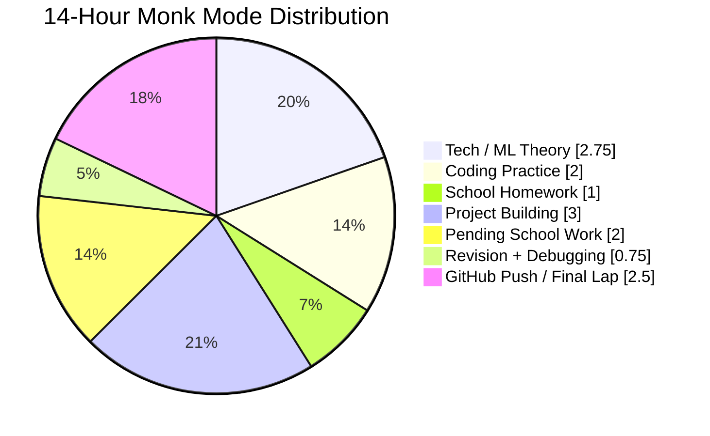
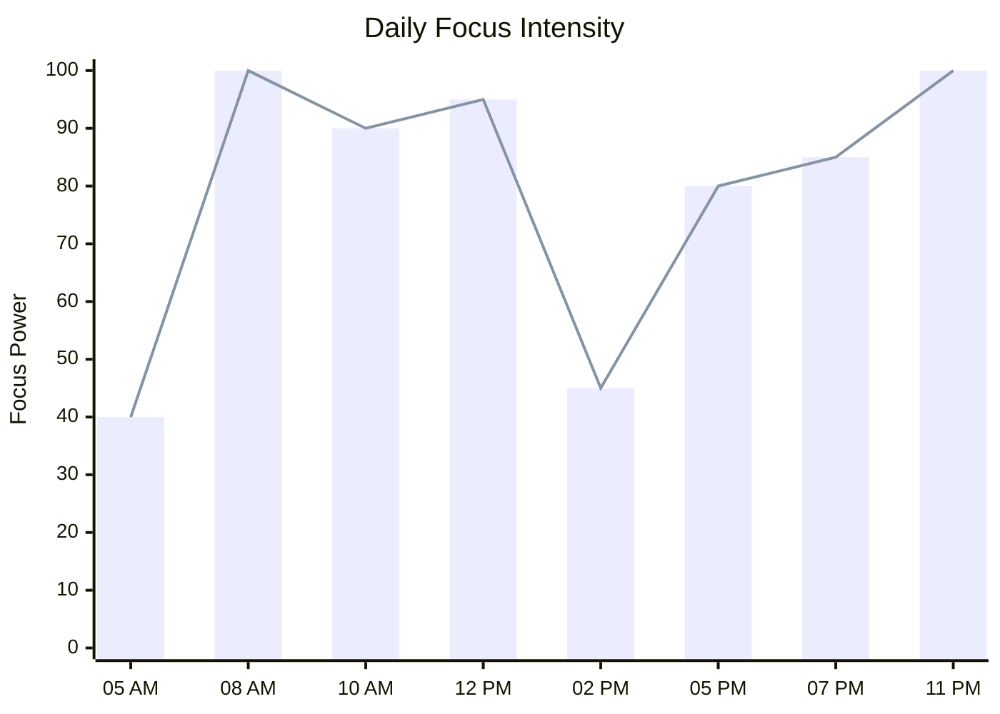
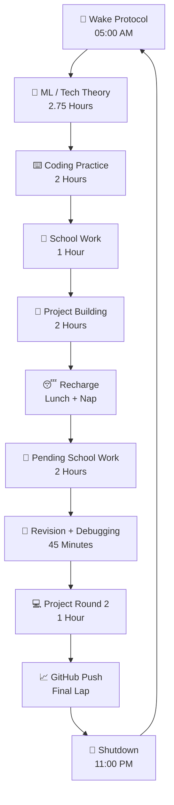

  

  

<h2>⚔️ 14 Hours of Execution. No Distractions. Just Legacy.</h2>

---

<table>
<tr>
<td align="center" width="20%">
<a href="#-14-hour-execution-grid">
 

</a>
</td>
<td align="center" width="20%">
<a href="Notes/Machine-Learning.md">
 

</a>
</td>
<td align="center" width="20%">
<a href="Projects/">
 

</a>
</td>
<td align="center" width="20%">
<a href="Days/">
 

</a>
</td>
<td align="center" width="20%">
<a href="Projects/">
 

</a>
</td>
</tr>
</table>

---

## 📊 MONK MODE GRAPHS

### ⏱️ Daily Time Distribution

### 🔥 Focus Intensity Graph

### 🧬 Discipline Evolution Timeline

### ⚙️ Execution Engine Graph

---

## 📈 LIVE REPO GRAPHICS

Replace `YOUR_USERNAME` and `YOUR_REPO_NAME` with your real GitHub username and repo name.

  

  

---

## 📂 SYSTEM ARCHITECTURE

  

