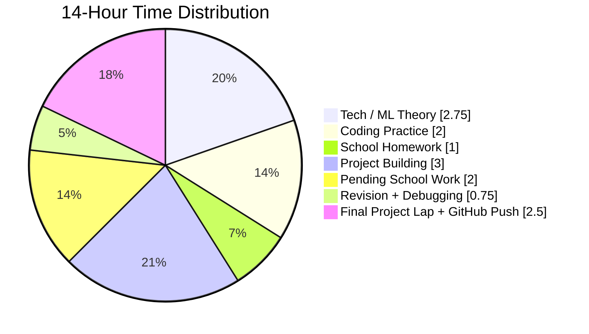
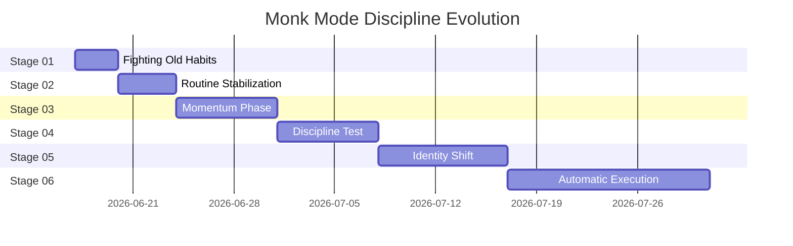
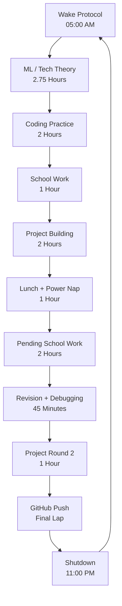

<div align="center">


<br/><br/>

<a href="#-command-center">
  
</a>
<a href="#-daily-mission-map">
  
</a>
<a href="#-14-hour-execution-grid">
  
</a>
<a href="#-monk-mode-graphs">
  
</a>
<a href="#-system-architecture">
  
</a>

<br/><br/>

<h2>⚔️ 14 Hours of Execution. No Distractions. Just Legacy.</h2>


</div>

---

<div align="center">

## 🚀 Command Center

<table>
<tr>
<td align="center" width="25%">
<br/>
<br/>
<b>Maximum Focus</b>
</td>
<td align="center" width="25%">
<br/>
<br/>
<b>Activation Protocol</b>
</td>
<td align="center" width="25%">
<br/>
<br/>
<b>Build Mode</b>
</td>
<td align="center" width="25%">
<br/>
<br/>
<b>Proof of Work</b>
</td>
</tr>
</table>

</div>

---

<div align="center">

## 🗺️ Daily Mission Map

<a href="#-14-hour-execution-grid">
<br/>

</a>

<br/><br/>

<table>
<tr>
<td align="center" width="20%">
<a href="Notes/Machine-Learning.md">
<br/>

</a>
</td>
<td align="center" width="20%">
<a href="Projects/">
<br/>

</a>
</td>
<td align="center" width="20%">
<a href="Days/">
<br/>

</a>
</td>
<td align="center" width="20%">
<a href="Projects/">
<br/>

</a>
</td>
<td align="center" width="20%">
<a href="Resources/">
<br/>

</a>
</td>
</tr>
</table>

</div>

---

<div align="center">

## 📅 14-Hour Execution Grid

</div>

<table>
<tr>
<th>Visual</th>
<th>Time</th>
<th>Runtime</th>
<th>Mission</th>
<th>Power</th>
</tr>
<tr>
<td align="center"></td>
<td><code>05:00 - 05:15</code></td>
<td><b>15 min</b></td>
<td><b>Wake Up Protocol</b></td>
<td></td>
</tr>
<tr>
<td align="center"></td>
<td><code>05:15 - 08:00</code></td>
<td><b>2.75 hrs</b></td>
<td><b>Tech / ML Theory Learning</b></td>
<td></td>
</tr>
<tr>
<td align="center"></td>
<td><code>08:30 - 10:30</code></td>
<td><b>2 hrs</b></td>
<td><b>Hands-on Coding Practice</b></td>
<td></td>
</tr>
<tr>
<td align="center"></td>
<td><code>10:45 - 11:45</code></td>
<td><b>1 hr</b></td>
<td><b>School Holiday Homework</b></td>
<td></td>
</tr>
<tr>
<td align="center"></td>
<td><code>12:00 - 02:00</code></td>
<td><b>2 hrs</b></td>
<td><b>Real-Life Project Building</b></td>
<td></td>
</tr>
<tr>
<td align="center"></td>
<td><code>02:00 - 03:00</code></td>
<td><b>1 hr</b></td>
<td><b>Lunch + Power Nap</b></td>
<td></td>
</tr>
<tr>
<td align="center"></td>
<td><code>03:00 - 05:00</code></td>
<td><b>2 hrs</b></td>
<td><b>Pending School Work</b></td>
<td></td>
</tr>
<tr>
<td align="center"></td>
<td><code>05:15 - 06:00</code></td>
<td><b>45 min</b></td>
<td><b>Revision + Debugging</b></td>
<td></td>
</tr>
<tr>
<td align="center"></td>
<td><code>06:00 - 07:00</code></td>
<td><b>1 hr</b></td>
<td><b>Project Implementation Round 2</b></td>
<td></td>
</tr>
<tr>
<td align="center"></td>
<td><code>08:30 - 11:00</code></td>
<td><b>2.5 hrs</b></td>
<td><b>Final Project Lap + GitHub Push</b></td>
<td></td>
</tr>
</table>

---

<div align="center">

## 📊 Monk Mode Graphs


</div>







---

<div align="center">

## 📈 Live Repo Graphics

Replace `YOUR_USERNAME` and `YOUR_REPO_NAME` with your real GitHub username and repository name.

<a href="https://github.com/YOUR_USERNAME/YOUR_REPO_NAME">
  
</a>

<br/><br/>


<br/><br/>


</div>

---

<div align="center">

## 🧬 Discipline Evolution System

<table>
<tr>
<td align="center">
<br/>
<b>STAGE 01</b><br/>
<code>DAY 01 - 03</code><br/>

</td>
<td align="center">
<br/>
<b>STAGE 02</b><br/>
<code>DAY 04 - 07</code><br/>

</td>
<td align="center">
<br/>
<b>STAGE 03</b><br/>
<code>DAY 08 - 14</code><br/>

</td>
</tr>
<tr>
<td align="center">
<br/>
<b>STAGE 04</b><br/>
<code>DAY 15 - 21</code><br/>

</td>
<td align="center">
<br/>
<b>STAGE 05</b><br/>
<code>DAY 22 - 30</code><br/>

</td>
<td align="center">
<br/>
<b>STAGE 06</b><br/>
<code>DAY 31+</code><br/>

</td>
</tr>
</table>

</div>

---

<div align="center">

## 📂 System Architecture

<a href="assets/">
  
</a>
<a href="Days/">
  
</a>
<a href="Notes/">
  
</a>
<a href="Projects/">
  
</a>
<a href="Resources/">
  
</a>

</div>

```text
Monk-Mode-14/
│
├── assets/
│   ├── layered-waves-haikei 1.png
│   ├── banner.png
│   └── progress-visuals/
│
├── Days/
│   ├── Day-01.md
│   ├── Day-02.md
│   └── Daily-Logs/
│
├── Notes/
│   ├── Machine-Learning.md
│   ├── Tech-Theory.md
│   └── Revision.md
│
├── Projects/
│   ├── Project-01/
│   ├── Project-02/
│   └── Shipping-Zone/
│
└── Resources/
    ├── Roadmaps.md
    ├── References.md
    └── Master-Plan.md
```

---

<div align="center">

## 🔥 Final Commandment


<br/><br/>


</div>
