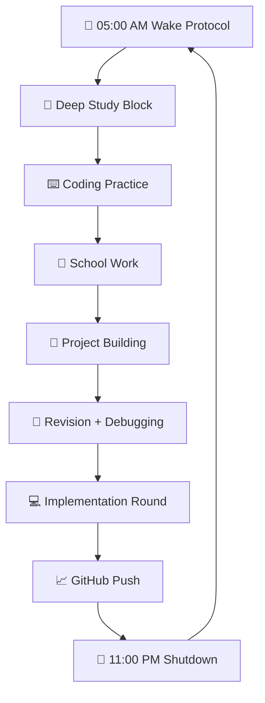

<div align="center">


### ⚔️ `14 HOURS OF EXECUTION` • 🧠 `ZERO DISTRACTIONS` • 🚀 `LEGACY MODE`


<br/><br/>


<br/><br/>

> ## **"14 Hours of Execution. No Distractions. Just Legacy."**

</div>

---

<div align="center">

## 📡 PROTOCOL DASHBOARD

<table>
  <tr>
    <td align="center" width="25%">
      <br/>
      <b>Deep Work</b><br/>
      <code>14 Hours</code>
    </td>
    <td align="center" width="25%">
      <br/>
      <b>Wake Protocol</b><br/>
      <code>05:00 AM</code>
    </td>
    <td align="center" width="25%">
      <br/>
      <b>Sleep Protocol</b><br/>
      <code>11:00 PM</code>
    </td>
    <td align="center" width="25%">
      <br/>
      <b>Mission</b><br/>
      <code>Legacy Build</code>
    </td>
  </tr>
</table>

</div>

---

## 🧬 DISCIPLINE EVOLUTION MAP

<div align="center">

| Stage | Days | Phase | Progress |
|---|---:|---|---|
| 🟥 **Stage 01** | `Day 01 - 03` | Fighting old habits | `████████████████████` |
| 🟧 **Stage 02** | `Day 04 - 07` | Routine starts feeling normal | `░░░░░░░░░░░░░░░░░░░░` |
| 🟨 **Stage 03** | `Day 08 - 14` | Momentum phase | `░░░░░░░░░░░░░░░░░░░░` |
| 🟩 **Stage 04** | `Day 15 - 21` | Real discipline test | `░░░░░░░░░░░░░░░░░░░░` |
| 🟦 **Stage 05** | `Day 22 - 30` | Identity shift begins | `░░░░░░░░░░░░░░░░░░░░` |
| 🟪 **Stage 06** | `Day 31+` | Automatic execution | `░░░░░░░░░░░░░░░░░░░░` |

</div>

---

## 📅 THE 14-HOUR EXECUTION GRID

<table>
  <tr>
    <th>Time</th>
    <th>Runtime</th>
    <th>Mission Block</th>
    <th>Type</th>
  </tr>
  <tr>
    <td><code>05:00 - 05:15</code></td>
    <td><b>15 min</b></td>
    <td>🌅 Wake up and quick fresh up</td>
    <td>⚡ Activation</td>
  </tr>
  <tr>
    <td><code>05:15 - 08:00</code></td>
    <td><b>2.75 hrs</b></td>
    <td>🧠 <b>Study Slot 1:</b> Tech / ML theory learning</td>
    <td>🟢 Deep Work</td>
  </tr>
  <tr>
    <td><code>08:00 - 08:30</code></td>
    <td><b>30 min</b></td>
    <td>🍳 Bath and breakfast block</td>
    <td>🟡 Reset</td>
  </tr>
  <tr>
    <td><code>08:30 - 10:30</code></td>
    <td><b>2 hrs</b></td>
    <td>⌨️ <b>Study Slot 2:</b> Hands-on coding practice</td>
    <td>🟢 Build</td>
  </tr>
  <tr>
    <td><code>10:30 - 10:45</code></td>
    <td><b>15 min</b></td>
    <td>🏃 Break</td>
    <td>🟡 Recovery</td>
  </tr>
  <tr>
    <td><code>10:45 - 11:45</code></td>
    <td><b>1 hr</b></td>
    <td>📝 <b>Study Slot 3:</b> School holiday homework</td>
    <td>🟠 School</td>
  </tr>
  <tr>
    <td><code>11:45 - 12:00</code></td>
    <td><b>15 min</b></td>
    <td>🏃 Break</td>
    <td>🟡 Recovery</td>
  </tr>
  <tr>
    <td><code>12:00 - 02:00</code></td>
    <td><b>2 hrs</b></td>
    <td>🚀 <b>Study Slot 4:</b> Real-life project building</td>
    <td>🔵 Project</td>
  </tr>
  <tr>
    <td><code>02:00 - 03:00</code></td>
    <td><b>1 hr</b></td>
    <td>😴 Lunch and afternoon power nap</td>
    <td>🟡 Recharge</td>
  </tr>
  <tr>
    <td><code>03:00 - 05:00</code></td>
    <td><b>2 hrs</b></td>
    <td>📁 <b>Study Slot 5:</b> Pending school work</td>
    <td>🟠 School</td>
  </tr>
  <tr>
    <td><code>05:00 - 05:15</code></td>
    <td><b>15 min</b></td>
    <td>🏃 Break</td>
    <td>🟡 Recovery</td>
  </tr>
  <tr>
    <td><code>05:15 - 06:00</code></td>
    <td><b>45 min</b></td>
    <td>📖 <b>Study Slot 6:</b> Mini theory revision and debugging</td>
    <td>🟣 Revision</td>
  </tr>
  <tr>
    <td><code>06:00 - 07:00</code></td>
    <td><b>1 hr</b></td>
    <td>💻 <b>Study Slot 7:</b> Project implementation round 2</td>
    <td>🔵 Project</td>
  </tr>
  <tr>
    <td><code>07:00 - 07:30</code></td>
    <td><b>30 min</b></td>
    <td>🙏 Pooja time</td>
    <td>⚪ Spiritual</td>
  </tr>
  <tr>
    <td><code>07:30 - 08:30</code></td>
    <td><b>1 hr</b></td>
    <td>🍽️ Dinner and family break</td>
    <td>🟡 Reset</td>
  </tr>
  <tr>
    <td><code>08:30 - 11:00</code></td>
    <td><b>2.5 hrs</b></td>
    <td>📈 <b>Study Slot 8:</b> Final project lap and GitHub push</td>
    <td>🟢 Ship</td>
  </tr>
</table>

---

## ⚙️ EXECUTION ENGINE



---

## 🧠 DAILY QUEST BOARD

<table>
  <tr>
    <td width="50%">
      <h3>🎯 Primary Quests</h3>
      <ul>
        <li>Complete all 8 study slots</li>
        <li>Push one meaningful GitHub commit</li>
        <li>Build real project features</li>
        <li>Finish school work without backlog</li>
      </ul>
    </td>
    <td width="50%">
      <h3>🚫 Forbidden Zones</h3>
      <ul>
        <li>No random scrolling</li>
        <li>No useless dopamine loops</li>
        <li>No delaying the first study block</li>
        <li>No sleeping without review</li>
      </ul>
    </td>
  </tr>
</table>

---

## 📂 FILE SYSTEM ARCHITECTURE

```bash
Monk-Mode-14/
│
├── assets/
│   ├── layered-waves-haikei 1.png
│   └── banner.png
│
├── Days/
│   ├── Day-01.md
│   ├── Day-02.md
│   └── Day-03.md
│
├── Notes/
│   ├── Machine-Learning.md
│   ├── Tech-Theory.md
│   └── Revision.md
│
├── Projects/
│   ├── Project-01/
│   ├── Project-02/
│   └── Experiments/
│
└── Resources/
    ├── Roadmaps.md
    ├── References.md
    └── Architecture.md
```

---

## ✅ DAILY LOG TEMPLATE

```md
# Day __ / Monk Mode 14

## Execution Checklist

- [ ] Wake up at 05:00 AM
- [ ] Study Slot 1 completed
- [ ] Study Slot 2 completed
- [ ] Study Slot 3 completed
- [ ] Study Slot 4 completed
- [ ] Study Slot 5 completed
- [ ] Study Slot 6 completed
- [ ] Study Slot 7 completed
- [ ] Study Slot 8 completed
- [ ] GitHub push completed
- [ ] Tomorrow planned

## Today's GitHub Push

Commit Message:

```txt
your commit message here
```

## Lesson Learned

Write one thing you learned today.

## Tomorrow's Main Target

Write the most important target for tomorrow.
```

---

<div align="center">

## 🏁 FINAL COMMANDMENT


<br/>


</div>
