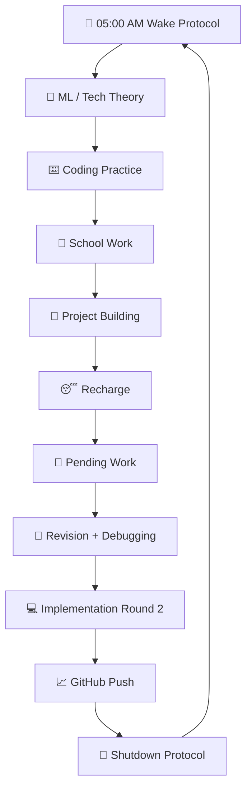

<div align="center">


<br/><br/>


<br/><br/>

<h2>⚔️ 14 Hours of Execution. No Distractions. Just Legacy.</h2>

</div>

---

<div align="center">

## 🚀 COMMAND CENTER

<table>
<tr>
<td align="center" width="25%">
<br/>
<h3>DEEP WORK</h3>
<b>14 HOURS</b><br/>
<sub>Pure execution window</sub>
</td>

<td align="center" width="25%">
<br/>
<h3>WAKE</h3>
<b>05:00 AM</b><br/>
<sub>Activation protocol</sub>
</td>

<td align="center" width="25%">
<br/>
<h3>BUILD</h3>
<b>PROJECTS</b><br/>
<sub>Real-life implementation</sub>
</td>

<td align="center" width="25%">
<br/>
<h3>SHIP</h3>
<b>GITHUB PUSH</b><br/>
<sub>Daily proof of work</sub>
</td>
</tr>
</table>

</div>

---

<div align="center">

## 🧬 DISCIPLINE EVOLUTION SYSTEM

<table>
<tr>
<th>Stage</th>
<th>Timeline</th>
<th>Identity Phase</th>
<th>Visual Progress</th>
</tr>

<tr>
<td align="center">🟥 <b>STAGE 01</b></td>
<td align="center"><code>Day 01 - 03</code></td>
<td><b>Fighting Old Habits</b></td>
<td><code>████████████████████</code></td>
</tr>

<tr>
<td align="center">🟧 <b>STAGE 02</b></td>
<td align="center"><code>Day 04 - 07</code></td>
<td><b>Routine Stabilization</b></td>
<td><code>░░░░░░░░░░░░░░░░░░░░</code></td>
</tr>

<tr>
<td align="center">🟨 <b>STAGE 03</b></td>
<td align="center"><code>Day 08 - 14</code></td>
<td><b>Momentum Phase</b></td>
<td><code>░░░░░░░░░░░░░░░░░░░░</code></td>
</tr>

<tr>
<td align="center">🟩 <b>STAGE 04</b></td>
<td align="center"><code>Day 15 - 21</code></td>
<td><b>Discipline Test</b></td>
<td><code>░░░░░░░░░░░░░░░░░░░░</code></td>
</tr>

<tr>
<td align="center">🟦 <b>STAGE 05</b></td>
<td align="center"><code>Day 22 - 30</code></td>
<td><b>Identity Shift</b></td>
<td><code>░░░░░░░░░░░░░░░░░░░░</code></td>
</tr>

<tr>
<td align="center">🟪 <b>STAGE 06</b></td>
<td align="center"><code>Day 31+</code></td>
<td><b>Automatic Execution</b></td>
<td><code>░░░░░░░░░░░░░░░░░░░░</code></td>
</tr>
</table>

</div>

---

<div align="center">

## 📅 14-HOUR WAR ROOM GRID

</div>

<table>
<tr>
<th>Phase</th>
<th>Time</th>
<th>Runtime</th>
<th>Mission</th>
<th>Mode</th>
</tr>

<tr>
<td align="center">🌅</td>
<td><code>05:00 - 05:15</code></td>
<td><b>15 min</b></td>
<td>Wake up and quick fresh up</td>
<td>⚡ Activation</td>
</tr>

<tr>
<td align="center">🧠</td>
<td><code>05:15 - 08:00</code></td>
<td><b>2.75 hrs</b></td>
<td><b>Study Slot 1:</b> Tech / ML theory learning</td>
<td>🟢 Deep Work</td>
</tr>

<tr>
<td align="center">🍳</td>
<td><code>08:00 - 08:30</code></td>
<td><b>30 min</b></td>
<td>Bath and breakfast block</td>
<td>🟡 Reset</td>
</tr>

<tr>
<td align="center">⌨️</td>
<td><code>08:30 - 10:30</code></td>
<td><b>2 hrs</b></td>
<td><b>Study Slot 2:</b> Hands-on coding practice</td>
<td>🟢 Build</td>
</tr>

<tr>
<td align="center">🏃</td>
<td><code>10:30 - 10:45</code></td>
<td><b>15 min</b></td>
<td>Break</td>
<td>🟡 Recovery</td>
</tr>

<tr>
<td align="center">📝</td>
<td><code>10:45 - 11:45</code></td>
<td><b>1 hr</b></td>
<td><b>Study Slot 3:</b> School holiday homework</td>
<td>🟠 School</td>
</tr>

<tr>
<td align="center">🚀</td>
<td><code>12:00 - 02:00</code></td>
<td><b>2 hrs</b></td>
<td><b>Study Slot 4:</b> Real-life project building</td>
<td>🔵 Project</td>
</tr>

<tr>
<td align="center">😴</td>
<td><code>02:00 - 03:00</code></td>
<td><b>1 hr</b></td>
<td>Lunch and afternoon power nap</td>
<td>🟡 Recharge</td>
</tr>

<tr>
<td align="center">📁</td>
<td><code>03:00 - 05:00</code></td>
<td><b>2 hrs</b></td>
<td><b>Study Slot 5:</b> Pending school work</td>
<td>🟠 School</td>
</tr>

<tr>
<td align="center">📖</td>
<td><code>05:15 - 06:00</code></td>
<td><b>45 min</b></td>
<td><b>Study Slot 6:</b> Mini theory revision and debugging</td>
<td>🟣 Revision</td>
</tr>

<tr>
<td align="center">💻</td>
<td><code>06:00 - 07:00</code></td>
<td><b>1 hr</b></td>
<td><b>Study Slot 7:</b> Project implementation round 2</td>
<td>🔵 Project</td>
</tr>

<tr>
<td align="center">🙏</td>
<td><code>07:00 - 07:30</code></td>
<td><b>30 min</b></td>
<td>Pooja time</td>
<td>⚪ Spiritual</td>
</tr>

<tr>
<td align="center">🍽️</td>
<td><code>07:30 - 08:30</code></td>
<td><b>1 hr</b></td>
<td>Dinner and family break</td>
<td>🟡 Reset</td>
</tr>

<tr>
<td align="center">📈</td>
<td><code>08:30 - 11:00</code></td>
<td><b>2.5 hrs</b></td>
<td><b>Study Slot 8:</b> Final project lap and GitHub push</td>
<td>🟢 Ship</td>
</tr>
</table>

---

<div align="center">

## ⚙️ EXECUTION ENGINE

</div>



---

<div align="center">

## 🎮 DAILY QUEST BOARD

<table>
<tr>
<td width="50%" valign="top">

### 🎯 Main Quests

- [ ] Complete 8 study slots
- [ ] Build one real feature
- [ ] Push one GitHub commit
- [ ] Finish school work block
- [ ] Review the whole day

</td>
<td width="50%" valign="top">

### 🚫 Forbidden Zones

- [ ] No random scrolling
- [ ] No delaying first block
- [ ] No fake productivity
- [ ] No sleeping without review
- [ ] No skipping GitHub push

</td>
</tr>
</table>

</div>

---

<div align="center">

## 🧠 SKILL TREE

<table>
<tr>
<td align="center" width="20%">
<br/>
<b>Machine Learning</b>
</td>
<td align="center" width="20%">
<br/>
<b>Coding</b>
</td>
<td align="center" width="20%">
<br/>
<b>School Work</b>
</td>
<td align="center" width="20%">
<br/>
<b>Projects</b>
</td>
<td align="center" width="20%">
<br/>
<b>GitHub</b>
</td>
</tr>
</table>

</div>

---

<div align="center">

## 📂 SYSTEM ARCHITECTURE

</div>

```text
Monk-Mode-14/
│
├── assets/
│   ├── layered-waves-haikei 1.png
│   ├── banner.png
│   └── progress-visuals/
│
├── Days/
│   ├── Day-01.md
│   ├── Day-02.md
│   ├── Day-03.md
│   └── Daily-Logs/
│
├── Notes/
│   ├── Machine-Learning.md
│   ├── Tech-Theory.md
│   ├── Coding-Notes.md
│   └── Revision.md
│
├── Projects/
│   ├── Project-01/
│   ├── Project-02/
│   ├── Experiments/
│   └── Shipping-Zone/
│
└── Resources/
    ├── Roadmaps.md
    ├── References.md
    ├── Architecture.md
    └── Master-Plan.md
```

---

<div align="center">

## 📊 DAILY SCORECARD

<table>
<tr>
<th>Metric</th>
<th>Target</th>
<th>Status</th>
</tr>

<tr>
<td>Wake Up</td>
<td><code>05:00 AM</code></td>
<td>⬜ Pending</td>
</tr>

<tr>
<td>Deep Work</td>
<td><code>14 Hours</code></td>
<td>⬜ Pending</td>
</tr>

<tr>
<td>Project Progress</td>
<td><code>1 Feature</code></td>
<td>⬜ Pending</td>
</tr>

<tr>
<td>GitHub Push</td>
<td><code>1 Commit</code></td>
<td>⬜ Pending</td>
</tr>

<tr>
<td>Daily Review</td>
<td><code>Night Review</code></td>
<td>⬜ Pending</td>
</tr>
</table>

</div>

---

<div align="center">

## 🔥 FINAL COMMANDMENT


<br/><br/>


</div>
