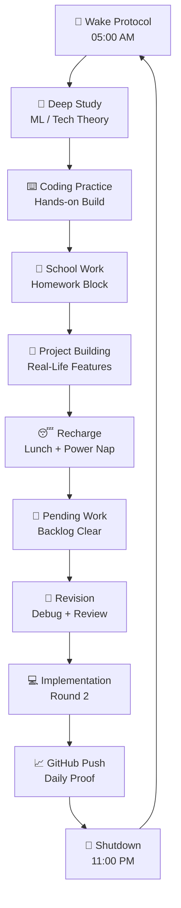

<div align="center">


<br/><br/>


<br/><br/>


<h2>⚔️ 14 Hours of Execution. No Distractions. Just Legacy.</h2>


</div>

<br/>

<div align="center">


<table>
<tr>
<td align="center" width="25%">
<br/>
<br/>
<b>Maximum Focus</b>
</td>
<td align="center" width="25%">
<br/>
<br/>
<b>Early Start</b>
</td>
<td align="center" width="25%">
<br/>
<br/>
<b>Build Mode</b>
</td>
<td align="center" width="25%">
<br/>
<br/>
<b>Proof of Work</b>
</td>
</tr>
</table>

</div>

---

<div align="center">


</div>

<table>
<tr>
<td align="center" width="20%">
<br/>
<b>05:00 AM</b><br/>

</td>
<td align="center" width="20%">
<br/>
<b>ML THEORY</b><br/>

</td>
<td align="center" width="20%">
<br/>
<b>CODING</b><br/>

</td>
<td align="center" width="20%">
<br/>
<b>SCHOOL</b><br/>

</td>
<td align="center" width="20%">
<br/>
<b>PROJECTS</b><br/>

</td>
</tr>
<tr>
<td align="center">
<br/>
<b>RECHARGE</b><br/>

</td>
<td align="center">
<br/>
<b>PENDING WORK</b><br/>

</td>
<td align="center">
<br/>
<b>REVISION</b><br/>

</td>
<td align="center">
<br/>
<b>GITHUB PUSH</b><br/>

</td>
<td align="center">
<br/>
<b>11:00 PM</b><br/>

</td>
</tr>
</table>

---

<div align="center">


</div>

<table>
<tr>
<th>Visual</th>
<th>Time</th>
<th>Mission</th>
<th>Power Level</th>
</tr>
<tr>
<td align="center"></td>
<td><code>05:00 - 05:15</code></td>
<td><b>Wake Up Protocol</b></td>
<td></td>
</tr>
<tr>
<td align="center"></td>
<td><code>05:15 - 08:00</code></td>
<td><b>Tech / ML Theory Learning</b></td>
<td></td>
</tr>
<tr>
<td align="center"></td>
<td><code>08:30 - 10:30</code></td>
<td><b>Hands-on Coding Practice</b></td>
<td></td>
</tr>
<tr>
<td align="center"></td>
<td><code>10:45 - 11:45</code></td>
<td><b>School Holiday Homework</b></td>
<td></td>
</tr>
<tr>
<td align="center"></td>
<td><code>12:00 - 02:00</code></td>
<td><b>Real-Life Project Building</b></td>
<td></td>
</tr>
<tr>
<td align="center"></td>
<td><code>02:00 - 03:00</code></td>
<td><b>Lunch + Power Nap</b></td>
<td></td>
</tr>
<tr>
<td align="center"></td>
<td><code>03:00 - 05:00</code></td>
<td><b>Pending School Work</b></td>
<td></td>
</tr>
<tr>
<td align="center"></td>
<td><code>05:15 - 06:00</code></td>
<td><b>Revision + Debugging</b></td>
<td></td>
</tr>
<tr>
<td align="center"></td>
<td><code>06:00 - 07:00</code></td>
<td><b>Project Implementation Round 2</b></td>
<td></td>
</tr>
<tr>
<td align="center"></td>
<td><code>07:00 - 07:30</code></td>
<td><b>Pooja Time</b></td>
<td></td>
</tr>
<tr>
<td align="center"></td>
<td><code>08:30 - 11:00</code></td>
<td><b>Final Project Lap + GitHub Push</b></td>
<td></td>
</tr>
</table>

---

<div align="center">


<table>
<tr>
<td align="center">
<br/>
<b>STAGE 01</b><br/>
<code>DAY 01 - 03</code><br/>

</td>
<td align="center">
<br/>
<b>STAGE 02</b><br/>
<code>DAY 04 - 07</code><br/>

</td>
<td align="center">
<br/>
<b>STAGE 03</b><br/>
<code>DAY 08 - 14</code><br/>

</td>
</tr>
<tr>
<td align="center">
<br/>
<b>STAGE 04</b><br/>
<code>DAY 15 - 21</code><br/>

</td>
<td align="center">
<br/>
<b>STAGE 05</b><br/>
<code>DAY 22 - 30</code><br/>

</td>
<td align="center">
<br/>
<b>STAGE 06</b><br/>
<code>DAY 31+</code><br/>

</td>
</tr>
</table>

</div>

---

<div align="center">


<table>
<tr>
<td align="center"><br/><b>Machine Learning</b><br/></td>
<td align="center"><br/><b>Coding</b><br/></td>
<td align="center"><br/><b>Systems</b><br/></td>
<td align="center"><br/><b>Projects</b><br/></td>
<td align="center"><br/><b>GitHub</b><br/></td>
</tr>
</table>

</div>

---

<div align="center">


<table>
<tr>
<td align="center" width="50%">
<br/>
<h3>MAIN QUESTS</h3>
<br/>
<br/>
<br/>

</td>
<td align="center" width="50%">
<br/>
<h3>FORBIDDEN ZONES</h3>
<br/>
<br/>
<br/>

</td>
</tr>
</table>

</div>

---

<div align="center">


</div>



---

<div align="center">


<table>
<tr>
<td align="center" width="20%">
<br/>
<b>assets/</b><br/>
<sub>Banners and graphics</sub>
</td>
<td align="center" width="20%">
<br/>
<b>Days/</b><br/>
<sub>Daily logs</sub>
</td>
<td align="center" width="20%">
<br/>
<b>Notes/</b><br/>
<sub>Learning docs</sub>
</td>
<td align="center" width="20%">
<br/>
<b>Projects/</b><br/>
<sub>Build zone</sub>
</td>
<td align="center" width="20%">
<br/>
<b>Resources/</b><br/>
<sub>Roadmaps</sub>
</td>
</tr>
</table>

</div>

```text
Monk-Mode-14/
│
├── assets/
│   ├── layered-waves-haikei 1.png
│   ├── banner.png
│   └── progress-visuals/
│
├── Days/
│   ├── Day-01.md
│   ├── Day-02.md
│   └── Daily-Logs/
│
├── Notes/
│   ├── Machine-Learning.md
│   ├── Tech-Theory.md
│   └── Revision.md
│
├── Projects/
│   ├── Project-01/
│   ├── Project-02/
│   └── Shipping-Zone/
│
└── Resources/
    ├── Roadmaps.md
    ├── References.md
    └── Master-Plan.md
```

---

<div align="center">


<br/><br/>


<br/><br/>


</div>
