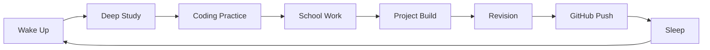

<div align="center">


# MONK MODE 14

### `14 Hours of Execution` | `No Distractions` | `Just Legacy`

> **"14 Hours of Execution. No Distractions. Just Legacy."**

<br/>


</div>

---

## Protocol Core Metrics

| Metric | Value |
|---|---|
| Focus Target | `14 Hours / Day` |
| Wake Time | `05:00 AM` |
| Sleep Time | `11:00 PM` |
| Mission | `Legacy Build` |

---

## Discipline Evolution Map

```txt
STAGE 01  ████████████████████  Day 01-03   Fighting old habits
STAGE 02  ░░░░░░░░░░░░░░░░░░░░  Day 04-07   Routine starts feeling normal
STAGE 03  ░░░░░░░░░░░░░░░░░░░░  Day 08-14   Momentum phase
STAGE 04  ░░░░░░░░░░░░░░░░░░░░  Day 15-21   Real discipline test
STAGE 05  ░░░░░░░░░░░░░░░░░░░░  Day 22-30   Identity shift begins
STAGE 06  ░░░░░░░░░░░░░░░░░░░░  Day 31+     Automatic execution
```

---

## The 14-Hour Grid

| Time Window | Runtime | Operation |
|---|---:|---|
| `05:00 AM - 05:15 AM` | `15 min` | Wake up and quick fresh up |
| `05:15 AM - 08:00 AM` | `2.75 hrs` | **Study Slot 1:** Tech / ML theory learning |
| `08:00 AM - 08:30 AM` | `30 min` | Bath and breakfast block |
| `08:30 AM - 10:30 AM` | `2 hrs` | **Study Slot 2:** Hands-on coding practice |
| `10:30 AM - 10:45 AM` | `15 min` | Break |
| `10:45 AM - 11:45 AM` | `1 hr` | **Study Slot 3:** School holiday homework |
| `11:45 AM - 12:00 PM` | `15 min` | Break |
| `12:00 PM - 02:00 PM` | `2 hrs` | **Study Slot 4:** Real-life project building |
| `02:00 PM - 03:00 PM` | `1 hr` | Lunch and afternoon power nap |
| `03:00 PM - 05:00 PM` | `2 hrs` | **Study Slot 5:** Pending school work |
| `05:00 PM - 05:15 PM` | `15 min` | Break |
| `05:15 PM - 06:00 PM` | `45 min` | **Study Slot 6:** Mini theory revision and debugging |
| `06:00 PM - 07:00 PM` | `1 hr` | **Study Slot 7:** Project implementation round 2 |
| `07:00 PM - 07:30 PM` | `30 min` | Pooja time |
| `07:30 PM - 08:30 PM` | `1 hr` | Dinner and family break |
| `08:30 PM - 11:00 PM` | `2.5 hrs` | **Study Slot 8:** Final project lap and GitHub push |

---

## Daily Execution Loop



---

## File System Architecture

```bash
Monk-Mode-14/
│
├── assets/          # Custom graphical overlays and banners
├── Days/            # Daily execution logs
├── Notes/           # ML / tech master documentation
├── Projects/        # Production source files
└── Resources/       # References and architecture roadmaps
```

---

## Daily Log Template

```md
# Day __ / Monk Mode 14

## Completed
- [ ] Study Slot 1
- [ ] Study Slot 2
- [ ] Study Slot 3
- [ ] Study Slot 4
- [ ] Study Slot 5
- [ ] Study Slot 6
- [ ] Study Slot 7
- [ ] Study Slot 8

## GitHub Push
Commit: `yes / no`

## Lesson Learned
Write one thing you learned today.

## Tomorrow's Target
Write tomorrow's main execution goal.
```

---

<div align="center">

## Final Rule

### **Discipline first. Motivation later.**


</div>
